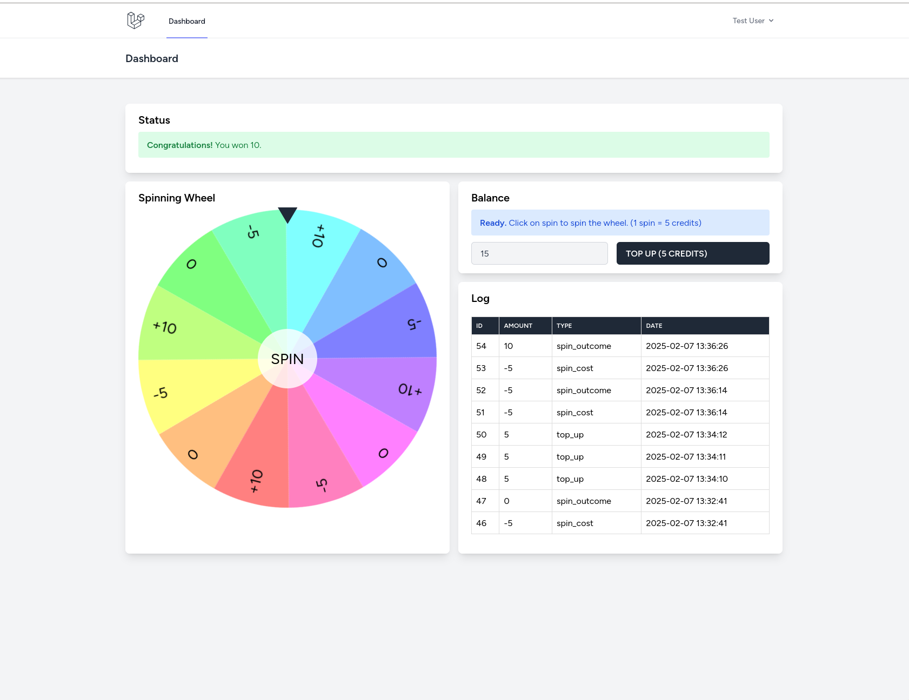

## spinning-wheel-game

This application has been developed for the assessment. Details about the assessment can be found in the documentation [mim.farm.assessment.md](mim.farm.assessment.md)

### requirements

See [mim.farm.assessment.md](mim.farm.assessment.md) for requirements.

### setup

1. Clone the repository
2. Rename .env.example to .env
3. Ensure Sail can start:
`docker run --rm --interactive --tty -v $(pwd):/app composer install`

4. Run `vendor/bin/sail up -d` or open in dev container
5. Install npm and build inside app directory, `npm i && npm run build`
5. Migrate & Seed `php artistan migrate --seed`

In case there are permission issues, access sail with root-shell and run `cd .. && chown -R sail:sail html`

### usage

1. Navigate to localhost
2. Login with default user `test@example.com` and `password`. (Or register new user, no email verify required.)
3. Top up balance and get on spinnin'.
